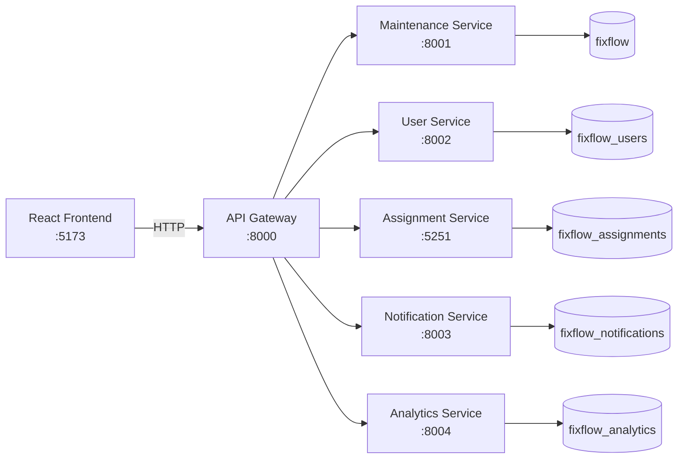
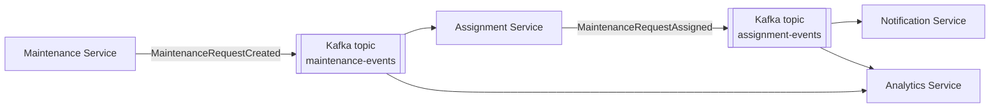

# FixFlow

FixFlow is an event-driven maintenance management platform built with a microservices architecture.

Users can:

- create and manage maintenance requests and track them through their lifecycle
- have assignments created automatically from Kafka events
- receive notifications when a request is assigned
- monitor operational analytics
- manage users and roles
- work through a responsive React dashboard

The project combines synchronous REST calls through an API Gateway with asynchronous Kafka messaging. Every service owns its own PostgreSQL database, and the services are written in Python (FastAPI) and C# (ASP.NET Core).

---

## Contents

- [Key Features](#key-features)
- [Architecture](#architecture)
- [Technology Stack](#technology-stack)
- [Service Ports](#service-ports)
- [Event-Driven Workflow](#event-driven-workflow)
- [Project Structure](#project-structure)
- [Local Setup](#local-setup)
- [Databases](#databases)
- [API Overview](#api-overview)
- [Testing](#testing)
- [MVP Limitations](#mvp-limitations)
- [Future Development](#future-development)
- [Screenshots](#screenshots)

---

## Key Features

### Dashboard
- Operational metrics: total, open, active high-priority and completed requests
- Lifecycle overview across Open → In Progress → Resolved → Closed
- The five most recent requests
- **Needs Attention:** active high-priority requests. The panel shows the first five and adds a "+N more" link to the Requests page.
- Status distribution summary

### Maintenance Requests
- Create, list, view, update and delete requests
- Edit title, description, location, priority and status
- Search by title, location or description, and filter by status and priority
- Newest requests appear first
- A details drawer, and confirmation before deleting

### Assignments
- **Created automatically:** each `MaintenanceRequestCreated` event from Kafka produces an assignment record.
- **Placeholder technician:** automatic assignment currently gives every request to technician ID `1`. Real technician selection is not implemented yet.
- **Enrichment:** rows are joined with current request and user data. If a request no longer exists, the page says so. If the request data could not be loaded at all, the page shows a neutral "unavailable" message instead of claiming the request is missing.
- Search by request title, location, technician or ID, filter by request status, and open a details drawer

### Notifications
- Assignment notifications are generated from `MaintenanceRequestAssigned` Kafka events
- The feed is grouped by day and enriched with request and recipient details
- Search by message, request, recipient or ID, and filter by type and read state
- Notifications are **read-only** in the MVP UI; the read state is displayed but can't be changed from the UI

### Analytics
The page shows two separate kinds of numbers:
- **Operational metrics.** The frontend calculates these from the current requests, assignments and users returned by the Gateway:
  - active work, including active high-priority requests
  - assignment coverage and requests with no assignment
  - breakdowns by status, by priority and by priority × status
  - workload per technician
  - busiest locations
- **Event-stream metrics.** The Analytics Service counts the Kafka events it has received: request-created events, assignment events, and priority at creation.
  - These counts are **cumulative**. They don't change when a request is later edited or deleted.
  - Because of that, they are not directly comparable with current operational totals. The page says so.

### Users
- Create, list, view, update and delete users
- Roles: `STUDENT`, `TECHNICIAN`, `ADMIN`
- Email addresses are validated and must be unique. A duplicate email returns **409 Conflict** from the User Service, and the form shows that message.
- Search, filter by role, and open a details drawer

### Cross-cutting
- The browser calls only the API Gateway
- The layout works on desktop and mobile, respects reduced-motion preferences, and shows a visible keyboard focus indicator
- Every page has loading, error (with Retry), empty and no-results states

---

## Architecture

### Request path (synchronous REST)



### Event flow (asynchronous Kafka)



### Design choices

- **API Gateway pattern.** The frontend talks to a single entry point (`localhost:8000`). The Gateway proxies to each service, passes through downstream status codes and bodies (for example 404, 409 and 422), and returns `503` when a service can't be reached. Every downstream call has an explicit 5-second timeout.
- **Database per service.** Each service owns its own PostgreSQL database. No service reads another service's tables.
- **Synchronous REST** handles what the user does directly: reading lists and details, and creating, updating and deleting requests and users.
- **Asynchronous Kafka integration** handles the follow-up work. Creating a request publishes an event, and the assignment, notification and analytics records are created by consumers, independently of the HTTP request that started it.
- **Keeping consumers alive.** The Assignment and Analytics consumers log a malformed or unprocessable event and carry on with the next one, so one bad message can't stop consumption. The Notification consumer also catches and logs processing errors.

---

## Technology Stack

| Layer | Technology |
|---|---|
| Frontend | React 19, TypeScript 6, Vite 8, ESLint |
| API Gateway | Python, FastAPI, httpx |
| Maintenance Service | Python, FastAPI, SQLAlchemy, confluent-kafka, PostgreSQL |
| User Service | Python, FastAPI, SQLAlchemy, Pydantic (email validation), PostgreSQL |
| Assignment Service | C#, ASP.NET Core (.NET 10), Entity Framework Core 10 (Npgsql), Confluent.Kafka, PostgreSQL |
| Notification Service | Python, FastAPI, SQLAlchemy, confluent-kafka, PostgreSQL |
| Analytics Service | Python, FastAPI, SQLAlchemy, confluent-kafka, PostgreSQL |
| Messaging | Apache Kafka 4.1 (single-node KRaft, `apache/kafka:4.1.0`) |
| Local infrastructure | Docker / Docker Compose (Kafka), PostgreSQL |
| Testing | pytest, xUnit, EF Core InMemory |

Versions are listed only where the project files pin them (`frontend/package.json`, `assignment-service.csproj`, `docker-compose.kafka.yml`).

---

## Service Ports

| Component | Port |
|---|---|
| Frontend (Vite dev server) | 5173 |
| API Gateway | 8000 |
| Maintenance Service | 8001 |
| User Service | 8002 |
| Notification Service | 8003 |
| Analytics Service | 8004 |
| Assignment Service | 5251 |
| Kafka | 9092 |
| PostgreSQL | 5432 |

> The browser communicates with the backend **only through the API Gateway** (`http://localhost:8000`). It never calls individual services directly. The Gateway's CORS policy allows `http://localhost:5173` and `http://127.0.0.1:5173`.

---

## Event-Driven Workflow

1. A user creates a maintenance request in the React frontend.
2. The frontend sends `POST /requests` to the API Gateway.
3. The Maintenance Service saves the request with status `OPEN`.
4. The Maintenance Service publishes `MaintenanceRequestCreated` to the **`maintenance-events`** topic.
5. The Assignment Service consumes the event.
6. The Assignment Service saves an assignment with status `ASSIGNED`.
7. The Assignment Service publishes `MaintenanceRequestAssigned` to the **`assignment-events`** topic.
8. The Notification Service consumes that event and creates an `ASSIGNMENT` notification for the requesting user.
9. The Analytics Service consumes both topics and records each event.
10. The frontend reads the resulting state through the Gateway.

If Kafka is unavailable when a request is created, the request is still saved and the publish failure is logged. No assignment is created for that request.

---

## Project Structure

```
Fixflow/
├── frontend/                     React + TypeScript + Vite dashboard
├── services/
│   ├── api-gateway/              FastAPI gateway (port 8000)
│   ├── maintenance-service/      FastAPI, maintenance requests + Kafka producer (8001)
│   ├── user-service/             FastAPI, users and roles (8002)
│   ├── assignment-service/       ASP.NET Core, assignments + Kafka consumer/producer (5251)
│   ├── assignment-service.Tests/ xUnit tests for the Assignment Service
│   ├── notification-service/     FastAPI, notifications + Kafka consumer (8003)
│   └── analytics-service/        FastAPI, event analytics + Kafka consumer (8004)
├── docker-compose.kafka.yml      Local single-node Kafka broker
└── README.md
```

Each Python service follows the same layout: `app/main.py` holds the routes, `app/services/` the business logic, `app/models.py` and `app/schemas.py` the data models, and `tests/` the tests.

---

## Local Setup

### Prerequisites

- Node.js and npm
- Python 3 (developed with Python 3.14)
- .NET 10 SDK, plus the `dotnet-ef` tool for applying migrations
- PostgreSQL, listening on `localhost:5432`
- Docker Desktop / Docker Engine with Docker Compose

### 1. Clone the repository

```bash
git clone <repository-url>
cd Fixflow
```

### 2. Create the PostgreSQL databases

Create one database per service, for example with `psql`:

```sql
CREATE DATABASE fixflow;                -- Maintenance Service
CREATE DATABASE fixflow_users;          -- User Service
CREATE DATABASE fixflow_assignments;    -- Assignment Service
CREATE DATABASE fixflow_notifications;  -- Notification Service
CREATE DATABASE fixflow_analytics;      -- Analytics Service
```

The Python services create their tables on startup (`Base.metadata.create_all`). The Assignment Service uses EF Core migrations; step 5 covers them.

### 3. Configure environment variables

Each service reads its settings from a `.env` file in its own directory. These files are git-ignored. Create them with your own credentials:

| File | Variables |
|---|---|
| `services/maintenance-service/.env` | `DATABASE_URL=postgresql+psycopg://<user>:<password>@localhost:5432/fixflow` |
| `services/user-service/.env` | `DATABASE_URL=postgresql+psycopg://<user>:<password>@localhost:5432/fixflow_users` |
| `services/notification-service/.env` | `DATABASE_URL=postgresql+psycopg://<user>:<password>@localhost:5432/fixflow_notifications` |
| `services/analytics-service/.env` | `DATABASE_URL=postgresql+psycopg://<user>:<password>@localhost:5432/fixflow_analytics` |
| `services/assignment-service/.env` | `DATABASE_CONNECTION_STRING=Host=localhost;Port=5432;Database=fixflow_assignments;Username=<user>;Password=<password>` |
| `frontend/.env` (copy `frontend/.env.example`) | `VITE_API_BASE_URL=http://localhost:8000` and `VITE_DEMO_USER_ID=<existing user id>` |

Optional variables:
- `KAFKA_BOOTSTRAP_SERVERS` defaults to `localhost:9092`. The Maintenance, Notification and Assignment services read it.
- `KAFKA_FLUSH_TIMEOUT_SECONDS` sets the Maintenance publish timeout and defaults to `2.0`.

> `VITE_DEMO_USER_ID` is a temporary stand-in until authentication exists. The Create Request form uses it as the requester, so it must be the ID of a user that exists. Create a user first (step 7 or `POST /users`).

### 4. Start Kafka

```bash
docker compose -f docker-compose.kafka.yml up -d
```

This starts a single-node KRaft broker (`fixflow-kafka`) on `localhost:9092`. The topics `maintenance-events` and `assignment-events` are created automatically the first time they are used.

### 5. Start the backend services

The Maintenance, Notification and Analytics services load `.env` from the current working directory, so **start each service from its own directory**.

Python services: set up a virtual environment once per service. Then run the service from its directory. The commands below are for Windows; on macOS/Linux use `.venv/bin/python`.

```bash
cd services/user-service
python -m venv .venv
.venv/Scripts/python.exe -m pip install <packages>   # see "Python dependencies" below
.venv/Scripts/python.exe -m uvicorn app.main:app --port 8002
```

| Service | Directory | Run command |
|---|---|---|
| User | `services/user-service` | `python -m uvicorn app.main:app --port 8002` |
| Maintenance | `services/maintenance-service` | `python -m uvicorn app.main:app --port 8001` |
| Notification | `services/notification-service` | `python -m uvicorn app.main:app --port 8003` |
| Analytics | `services/analytics-service` | `python -m uvicorn app.main:app --port 8004` |

Assignment Service (.NET):

```bash
cd services/assignment-service
dotnet ef database update          # apply EF Core migrations (first run)
dotnet run --launch-profile http   # serves http://localhost:5251
```

#### Python dependencies

The Python services don't have `requirements.txt` files yet (see [Documentation gaps](#documentation-gaps)). This list comes from each service's imports:

| Service | Packages |
|---|---|
| api-gateway | `fastapi`, `uvicorn`, `httpx`, `pytest` |
| maintenance-service | `fastapi`, `uvicorn`, `sqlalchemy`, `pydantic-settings`, `psycopg[binary]`, `confluent-kafka`, `httpx`, `pytest` |
| user-service | `fastapi`, `uvicorn`, `sqlalchemy`, `pydantic-settings`, `email-validator`, `psycopg[binary]`, `httpx`, `pytest` |
| notification-service | `fastapi`, `uvicorn`, `sqlalchemy`, `pydantic-settings`, `psycopg[binary]`, `confluent-kafka`, `httpx`, `pytest` |
| analytics-service | `fastapi`, `uvicorn`, `sqlalchemy`, `pydantic-settings`, `psycopg[binary]`, `confluent-kafka`, `pytest` |

(`httpx` is needed by FastAPI's `TestClient` in the test suites.)

### 6. Start the API Gateway

```bash
cd services/api-gateway
python -m uvicorn app.main:app --port 8000
```

Check it's up: `curl http://localhost:8000/health`, which returns `{"status":"healthy"}`. The Python services expose the same `/health` endpoint. The Assignment Service has no health endpoint; use `GET http://localhost:5251/assignments` instead.

### 7. Start the frontend

```bash
cd frontend
npm install
npm run dev        # http://localhost:5173
```

The pages are Dashboard, Requests, Assignments, Notifications, Analytics and Users. Use the sidebar, or open a page directly with `?page=requests`, `?page=assignments` and so on.

---

## Databases

| Database | Owning service | Contents |
|---|---|---|
| `fixflow` | Maintenance Service | `maintenance_requests` |
| `fixflow_users` | User Service | `users` |
| `fixflow_assignments` | Assignment Service | `Assignments` (EF Core migrations) |
| `fixflow_notifications` | Notification Service | `notifications` |
| `fixflow_analytics` | Analytics Service | `analytics_events` |

Services never share tables. Data that crosses services, such as request IDs in assignments and user IDs in notifications, travels in Kafka event payloads and is combined in the frontend.

---

## API Overview

All routes below are exposed by the **API Gateway** at `http://localhost:8000`.

| Area | Method | Path | Notes |
|---|---|---|---|
| Health | GET | `/health` | Gateway health |
| Requests | GET | `/requests` | List requests |
| | GET | `/requests/{id}` | Request details (404 if missing) |
| | POST | `/requests` | Create; publishes `MaintenanceRequestCreated` |
| | PUT | `/requests/{id}` | Update title, description, location, priority, status |
| | DELETE | `/requests/{id}` | Delete |
| Assignments | GET | `/assignments` | List assignments |
| | POST | `/assignments` | Create an assignment manually; publishes `MaintenanceRequestAssigned` |
| Notifications | GET | `/notifications` | List notifications (newest first) |
| | POST | `/notifications` | Create a notification |
| Analytics | GET | `/analytics/summary` | Cumulative event counts and priority breakdown |
| Users | GET | `/users` | List users |
| | GET | `/users/{id}` | User details (404 if missing) |
| | POST | `/users` | Create (409 on duplicate email, 422 on invalid input) |
| | PUT | `/users/{id}` | Update (404 / 409 / 422) |
| | DELETE | `/users/{id}` | Delete (404 if missing) |

Error behavior is the same on every route:
- the downstream status code and JSON body are passed through unchanged;
- `503 {"detail": "<Service> service unavailable"}` is returned when a service can't be reached or times out (5 seconds).

The Notification Service also has `GET /notifications/{id}` and `PATCH /notifications/{id}/read`, but the Gateway **does not expose them** in the MVP.

---

## Testing

| Component | Framework | What it uses | Safe to run against a dev setup? |
|---|---|---|---|
| API Gateway | pytest | All downstream calls mocked | ✅ Yes |
| Assignment Service | xUnit | EF Core InMemory, fake Kafka producer | ✅ Yes |
| Notification Service | pytest | In-memory SQLite, fake Kafka consumer | ✅ Yes |
| Analytics Service | pytest | In-memory SQLite, mocked Kafka client | ✅ Yes |
| Maintenance Service | pytest | **The configured `DATABASE_URL`** (Kafka publishing is mocked) | ⚠️ Partly: some tests insert rows |
| User Service | pytest | **The configured `DATABASE_URL`** | ❌ No: the fixtures delete **all** users |

> ⚠️ **Some tests touch the database they're configured for.**
> - The **User Service** tests delete every row in the `users` table before and after each test.
> - Three **Maintenance Service** tests (`test_create_request`, `test_create_request_succeeds_when_kafka_publish_fails`, `test_create_request_response_schema_fields`) insert real requests.
>
> Run these suites **only against a disposable test database**, never against development data. With pydantic-settings, an environment variable takes precedence over the `.env` file, so you can point a run at a throwaway database by setting `DATABASE_URL` for that command.

### Safe commands

Run each Python suite from its service directory, using that service's virtual environment:

```bash
# API Gateway, Notification and Analytics: fully isolated
cd services/api-gateway && python -m pytest
cd services/notification-service && python -m pytest
cd services/analytics-service && python -m pytest

# Maintenance: only the tests that don't write to the database
cd services/maintenance-service
python -m pytest -k "test_get_requests or test_database_failure_still_fails_request_creation or test_invalid_request or test_request_not_found"

# Assignment Service (xUnit)
dotnet test services/assignment-service.Tests/assignment-service.Tests.csproj
```

### Frontend checks

```bash
cd frontend
npm run lint
npm run build
```

There are no automated frontend tests yet. The frontend was verified manually and with browser-based smoke tests.

---

## MVP Limitations

These are deliberate boundaries of the MVP, not defects in its core flow:

- **Placeholder technician assignment.** Automatic assignments always use technician ID `1`, which may not match a real user.
- **No authentication or role-based access control yet.** The frontend acts as one configured demo user (`VITE_DEMO_USER_ID`).
- **Notifications are read-only in the UI.** The Notification Service supports marking a notification as read, but the Gateway and UI don't expose it.
- **Kafka has no retries or dead-letter topic.** An event that fails processing is logged and skipped.
- **Auto-commit offsets.** Consumers use Kafka's default auto-commit, so an event that fails is not reprocessed later.
- **No cleanup across services.** Deleting a request does not remove its assignments or notifications.
- **Notification timestamps have no time zone.** Notifications store a timestamp without time zone, while assignments store UTC. Times display as recorded, which can differ between environments.
- **Analytics event counts are cumulative.** They record events as received and are not adjusted for later edits or deletions.
- **Some tests need an isolated database.** The User and Maintenance suites write to their configured databases (see [Testing](#testing)).

---

## Future Development

- Authentication and role-based access control (RBAC)
- Real technician assignment based on availability, skills and workload
- Notification actions (mark as read) exposed through the Gateway and UI
- Kafka retry handling and dead-letter topics
- Idempotent, reliable event processing with manual offset commits
- Improved historical analytics with time-based trends
- UTC and time-zone normalization across services
- Real-time frontend updates (for example WebSockets or server-sent events)
- Isolated integration-test databases and a consistent test setup across services
- Declared Python dependencies (`requirements.txt`) and a containerized setup for all services
- Deployment, centralized logging, metrics and tracing
- Remaining accessibility polish, such as focus trapping in dialogs and closing the mobile navigation with Escape

---

## Screenshots

<!--
  Screenshots have not been added to the repository yet.
  Planned captures (desktop, plus mobile where useful):
    1. Dashboard: metrics, lifecycle, recent requests, Needs Attention
    2. Requests: list with filters, details drawer, create dialog
    3. Assignments: list and details drawer
    4. Notifications: feed grouped by day
    5. Analytics: operational metrics and the event-stream panel
    6. Users: directory and create/edit dialog
-->

_Screenshots coming soon: Dashboard, Requests, Assignments, Notifications, Analytics and Users._

---

### Documentation gaps

The repository doesn't yet include the following. The setup steps above rely on it:

- `requirements.txt` / `pyproject.toml` for the Python services; the dependency list above comes from the code's imports
- `.env.example` templates for the backend services; only `frontend/.env.example` exists
- A database bootstrap script or Docker setup for PostgreSQL and the application services; only Kafka is containerized
